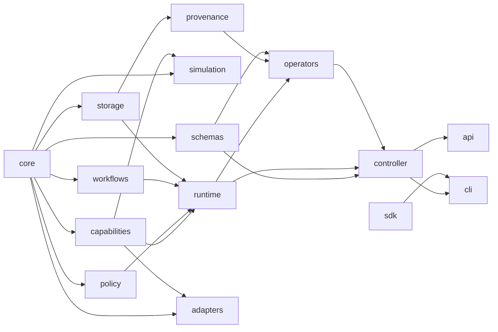

# Architecture

## Product boundary

OpenSDL is the portable foundation around a laboratory implementation. It owns contracts, reference execution, extension interfaces, conformance, provenance, and developer tooling. It does not attempt to replace every instrument driver, robot framework, LIMS, ELN, workflow engine, scientific solver, optimizer, or safety controller.

## Two-repository model

### Framework repository

The public monorepo contains reusable packages, applications, adapters, domain packs, templates, and tests.

### Laboratory repository

An organization repository contains the concrete laboratory manifest, private workflows, local adapters, domain extensions, deployment settings, and validation evidence. It depends on released OpenSDL packages and can selectively override components through extension interfaces.

This separation prevents proprietary operational state from leaking into the public framework while preserving a standard implementation shape.

## Package dependency direction

Rules:

1. `core` imports no internal package.
2. Applications compose packages; domain behavior does not live in applications.
3. Vendor and facility code belongs in adapters.
4. Schemas remain language-neutral even when Pydantic is the Python implementation.
5. Storage is accessed through repository interfaces.
6. Simulation is available without importing physical adapters.
7. Operator transports depend on the runtime; the runtime does not depend on a particular transport.

`scripts/check-boundaries.py` enforces these rules.

## Execution model

A workflow is a directed acyclic graph of capability invocations. The reference runtime:

1. validates the graph;
2. creates or resumes a durable run;
3. evaluates policy for each step;
4. leases required resources;
5. resolves inputs from workflow inputs and predecessor outputs;
6. executes ready steps concurrently;
7. records attempts, outputs, failures, and events;
8. releases leases;
9. resolves workflow outputs;
10. stores a content-addressed run record.

Running tasks found after a controller restart are marked `intervention_required`. A caller can then inspect physical state before resuming. This avoids pretending database rollback reverses a physical action.

## Capability contract

Each capability declares:

- stable identifier and version;
- executor type;
- JSON input and output schemas;
- resources and side effects;
- risk class;
- timeout, retries, and cancellation support;
- simulator availability;
- extension metadata.

The adapter controls transport details. Workflows request semantic capabilities rather than vendor commands.

## Persistence

Relational tables store runs, tasks, events, capabilities, resources, leases, artifacts, and schema versions. SQLite is the default local profile; SQLAlchemy keeps the model portable to PostgreSQL.

Artifact bytes live outside the relational database. The local store uses SHA-256-addressed paths and verifies content on read. S3-compatible storage is a planned adapter.

## Provenance and graphs

The append-only event stream is the historical source. Current state and research graphs are projections. Portable exports package run metadata, tasks, events, and artifact bytes.

The repository propagation graph is separate from the scientific graph. It tracks implementation dependencies such as schema → adapter → tests → examples → docs.

## Operator interfaces

The same contracts are exposed through:

- the Python SDK;
- CLI commands;
- the HTTP API;
- a transport-neutral operator gateway;
- an optional MCP server when the MCP package is installed.

No operator receives raw device transport as a framework primitive. An organization may grant broad authority, but execution remains represented through declared capabilities and recorded receipts.

## Extensibility

Entry-point groups:

- `opensdl.adapters`
- `opensdl.optimizers`
- `opensdl.domain_packs`

Future extension groups will cover storage, artifact stores, policy providers, exporters, and orchestration backends once two independent implementations justify a stable interface.

## Deployment profiles

- `simulation`: virtual equipment and compute, suitable for CI.
- `assisted`: structured human tasks mixed with connected systems.
- `automated`: validated deterministic workcells.
- `closed-loop`: optimization selects subsequent work inside declared bounds.
- `air-gapped`: local models and services with controlled package promotion.

The current reference implementation fully supports the simulation profile and a basic assisted path through structured human attestations. Interactive queues, electronic signatures, and deployment-specific identity controls remain future integrations.
