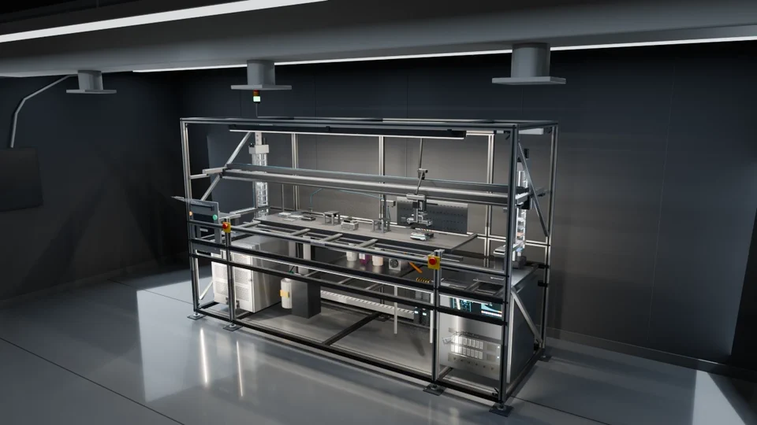
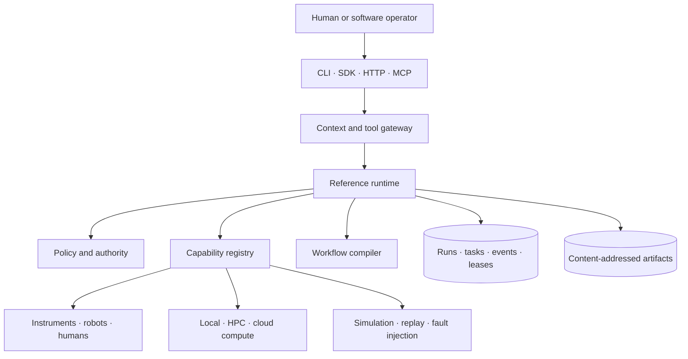

<h1 align="center">OpenSDL</h1>

<p align="center">
  <strong>An open foundation for building computational and autonomous laboratories.</strong>
</p>

<p align="center">
  <a href="#project-status"></a>
  <a href="https://github.com/fl-sean03/OpenSDL/actions/workflows/ci.yml"></a>
  <a href="pyproject.toml"></a>
  <a href="LICENSE"></a>
</p>

<p align="center">
  
</p>

<p align="center">
  <sub>A simulated self-driving-laboratory cell executing the authored workflow, rendered from procedural Blender source committed in this repository — a reference surrogate, not an instrument OpenSDL ships.</sub>
</p>

<p align="center">
  <a href="examples/digital-twin-surrogate/scene/renders/opensdl-surrogate-cell.mp4">Full 49-second render</a> ·
  <a href="examples/digital-twin-surrogate/README.md">The example behind it</a> ·
  <a href="examples/digital-twin-surrogate/scene/README.md">How the scene is built</a>
</p>

## What this is

OpenSDL is a modular framework for defining laboratory capabilities, connecting physical and computational systems, executing reproducible workflows, preserving evidence, and progressively moving from manual operation to bounded closed-loop experimentation.

It is built as normal scientific software: installable packages, deployable applications, versioned schemas, replaceable adapters, a relational schema and its initial migration, simulations, tests, project generators, and complete runnable examples.

Everything here runs today in a simulator-only reference profile. It is an alpha. Read [project
status](#project-status) for what is implemented, and [SAFETY.md](SAFETY.md) for where the framework
stops and a laboratory's own protective systems begin.

## Quick start

Prerequisites: Python 3.12 or newer and [`uv`](https://docs.astral.sh/uv/).

```bash
git clone https://github.com/fl-sean03/OpenSDL.git opensdl
cd opensdl

uv sync --locked --all-packages --group dev
uv run --locked opensdl validate examples/simulated-color-mixing/opensdl.yaml \
  --workflow examples/simulated-color-mixing/workflow.yaml
uv run --locked python examples/simulated-color-mixing/run_campaign.py
```

The reference campaign needs no hardware, cloud account, model API, graph database, or message broker. It creates virtual samples, measures color and mass, scores each experiment, persists all runs and events, records campaign decisions, and identifies the best recipe.

Run one workflow directly:

```bash
uv run --locked opensdl run examples/simulated-color-mixing/workflow.yaml \
  --manifest examples/simulated-color-mixing/opensdl.yaml \
  --inputs '{
    "sample_id": "demo-001",
    "red_fraction": 0.5,
    "blue_fraction": 0.5,
    "total_mass_g": 5,
    "target_rgb": [127.5, 0, 127.5]
  }'
```

Start the API:

```bash
uv run --locked opensdl serve-api \
  --manifest examples/simulated-color-mixing/opensdl.yaml
```

Then open `http://127.0.0.1:8000/docs`.

The [digital-twin surrogate example](examples/digital-twin-surrogate/README.md) runs a complete
simulated workflow against an original, real-scale Flex-class reference scene. Its authored motion
spans 1176 frames over 49 seconds.

## What works now

The v0.1 alpha includes:

- a versioned laboratory manifest;
- domain-neutral models for capabilities, resources, workflows, runs, tasks, events, artifacts, observations, decisions, authorizations, and incidents;
- a durable reference runtime with DAG execution, retries, timeouts that bound how long the runtime waits — abandoned adapter work keeps running — resource leases, restart reconciliation, and policy checks;
- SQLite metadata storage through SQLAlchemy, using portable column types and a PostgreSQL driver dependency; no PostgreSQL service is exercised by any test or CI job;
- content-addressed local artifact storage;
- adapter and optimizer plugin discovery through Python entry points;
- deterministic virtual mixer, balance, colorimeter, and labware-transport capabilities;
- three fixed local numerical capabilities — Euclidean distance, summary statistics, and a quadratic — which are safe because they evaluate no caller-supplied expression, not because an evaluator is sandboxed;
- a structured human-task record with a typed outcome, notes, and evidence fields, carrying a caller-supplied operator name that nothing verifies;
- a campaign runner that scores each run and feeds the result back to an optimizer, plus a reference grid optimizer that discards the feedback and enumerates a fixed grid;
- CLI, Python SDK, HTTP API, and optional MCP transport hook;
- versioned digital-twin bindings, verified GLB delivery, persisted-run projection, and a read-only
  viewer;
- JSON Schema generation and YAML validation;
- run export as a portable RO-Crate-style ZIP;
- a repository propagation graph for identifying affected contracts, code, tests, examples, and documentation;
- materials, chemistry, and physics extension packs, each exposing a small set of typed models as JSON Schema, with no units, no capabilities, and no committed schemas;
- generators for organization laboratory repositories, adapters, capabilities, and domain packs;
- unit, integration, end-to-end, and conformance tests.

## Create an organization lab project

The public framework and an organization’s laboratory implementation should be separate projects.

```bash
uv run --locked opensdl init ../my-lab \
  --name my-lab \
  --owner my-organization
```

This scaffolds an independent OpenSDL-based lab project, which should live in its own Git
repository. It is not a GitHub fork of the framework source. The lab project consumes versioned
OpenSDL packages and owns its equipment, workflows, integrations, context, and deployment. Fork
OpenSDL itself only when you intend to change the framework.

The generated repository can add private equipment definitions, domain models, workflows, compute backends, policies, deployments, and local adapters without modifying OpenSDL core.

Start a normal agent conversation in the generated repository and ask it to “start here.” The
`start-here` skill records confirmed lab context, maps the first workflow, and hands implementation
to the relevant repository skills. See [lab onboarding](docs/architecture/lab-onboarding.md).

<details>
<summary>Package sources, generated layout, and CI for the new repository</summary>

The generated lab needs a package source for the OpenSDL alpha distributions. If they are absent
from your configured registry, build a local wheelhouse from this checkout for a smoke test:

```bash
uv build --all-packages --wheel --out-dir dist
cd ../my-lab
uv sync --find-links ../opensdl/dist
```

This local source can be recorded in the generated `uv.lock`. Use a stable registry or committed
artifact source before treating that lockfile as portable across clones. Generated CI validates
agent files immediately and runs full checks after `OPENSDL_PACKAGES_AVAILABLE=true` is configured
as a repository variable.

The generated repository contains:

```text
my-lab/
├── .agents/skills/
├── .claude/skills/
├── .github/workflows/
├── capabilities/
├── deployments/
├── docs/lab/             # Shared context, inventory, setup plan, and decisions
├── policies/
├── scripts/
├── src/my_lab/
├── tests/
├── workflows/
├── AGENTS.md
├── CLAUDE.md
├── DEVELOPMENT.md
├── README.md
├── opensdl.yaml
└── pyproject.toml
```

</details>

## Architecture



A capability is the central abstraction. It can be executed by a person, instrument, robot, simulator, analysis routine, compute system, or optimizer. Every capability declares typed inputs and outputs, resources, side effects, risk class, timeout, retry behavior, and simulation status.

OpenSDL does not require one device protocol or orchestration backend. Adapters can wrap SiLA 2, OPC UA, EPICS, ROS 2, SCPI/VISA, Bluesky, PyLabRobot, MADSci, Slurm, Kubernetes, vendor SDKs, human tasks, or internal services.

See [ARCHITECTURE.md](ARCHITECTURE.md) and the
[agent-native operation plan](docs/architecture/agent-native-operation.md). The
[digital-twin plan](docs/architecture/digital-twin.md) defines the on-demand Blender path for custom
models in laboratory repositories. OpenSDL does not ship a shared equipment-model catalog.

## Data and provenance

OpenSDL separates:

- planned workflow inputs;
- executed task inputs and outputs;
- append-only events;
- immutable artifact bytes and hashes;
- campaign decisions;
- current-state projections.

A graph is generated from those records rather than treated as the only source of truth. Run bundles include the run, tasks, events, artifacts, and RO-Crate metadata.

## Repository layout

Reusable libraries live in `packages/`, deployable applications in `apps/`, vendor and facility
integrations in `adapters/`, and scientific extensions in `domain-packs/`.

<details>
<summary>Full directory tree</summary>

```text
.
├── apps/                 # Thin deployable controller and HTTP API
├── packages/             # Reusable libraries plus packaged project templates
├── adapters/             # Reference physical, compute, and optimization extensions
├── domain-packs/         # Materials, chemistry, and physics schemas
├── examples/             # Complete runnable laboratories and campaigns
├── database/             # Alembic configuration and migrations
├── deployments/          # Local containers and development environment
├── tests/                # Cross-package integration, E2E, and conformance tests
├── scripts/              # Development and release automation
├── docs/                 # Concepts, architecture, guides, and reference
├── .agents/              # Canonical repository and laboratory lifecycle skills
├── .claude/              # Claude Code adapters for the canonical skills
├── AGENTS.md             # Concise scoped project instructions
├── CLAUDE.md             # Claude Code import for the root instructions
├── DEVELOPMENT.md        # Exact developer workflow
└── pyproject.toml        # uv workspace and shared tooling configuration
```

</details>

## Extensibility

Installable extensions use standard Python entry points. Local organization adapters may live in the
laboratory repository, public adapters may ship as independent packages, and the same pattern
supports optimizers and domain packs.

<details>
<summary>Entry-point declaration and the adapter and domain-pack generators</summary>

```toml
[project.entry-points."opensdl.adapters"]
my-balance = "my_lab.adapters.balance:BalanceAdapter"
```

Generate an adapter:

```bash
uv run --locked opensdl adapter create my-balance \
  --capability-id instrument.measure_mass \
  --destination ../my-lab/adapters
```

Generation writes an installable package and does not install it. The laboratory must also depend on
that package and declare it in its manifest before the runtime can find it. [Add an
adapter](docs/guides/add-adapter.md) covers the whole path.

Every operational adapter should include a simulator, conformance cases, typed failures, lifecycle behavior, and hardware validation notes.

Generate a scientific domain pack:

```bash
uv run --locked opensdl domain-pack create electrochemistry \
  --destination ../my-lab/domain-packs
```

</details>

## Repository propagation

`propagation.yaml` describes the blast radius of important changes, which makes cross-repository
consistency testable instead of relying only on search and memory.

<details>
<summary>Running the propagation query</summary>

```bash
uv run --locked opensdl propagate packages/core/src/opensdl_core/models.py
```

The result identifies affected adapters, schemas, tests, examples, API contracts, generated documentation, and deployment files.

</details>

## Safety boundary

OpenSDL is not a safety instrumented system, emergency-stop circuit, process hazard analysis, or compliance certification. Physical interlocks and deterministic protective systems remain independent from the framework.

The reference profile is simulator-only. Real deployments are responsible for appropriate engineering controls, validation, authorization, network segmentation, training, operating procedures, and regulatory requirements. See [SAFETY.md](SAFETY.md).

## Project status

This is an executable alpha, not production-qualified laboratory control software.

The core loop, structured human-task path, simulated robotics path, and local compute path are implemented and tested. Current work is focused on production authentication, richer approval workflows, MADSci and SiLA 2 integrations, Slurm execution, expanded conformance, and the first low-risk hardware reference integration.

No contract is stable between releases yet, no laboratory database can be upgraded in place, and
there is no deprecation window. [Compatibility and versioning](docs/reference/compatibility.md)
states exactly which surfaces are public, what each guarantees today, and what a laboratory should
pin. Read it before depending on any of them.

See [ROADMAP.md](ROADMAP.md), the [development backlog](docs/development/backlog.md),
[DEVELOPMENT.md](DEVELOPMENT.md), and the evidence-based [VALIDATION.md](VALIDATION.md).

The supplied alpha archive and its checksum-verified import are documented in
[IMPORT_PROVENANCE.md](IMPORT_PROVENANCE.md).

## License

Software, schemas, examples, and documentation are provided under the [Apache License 2.0](LICENSE) unless a directory states otherwise. Hardware designs and datasets should carry explicit licenses appropriate to those artifacts.
