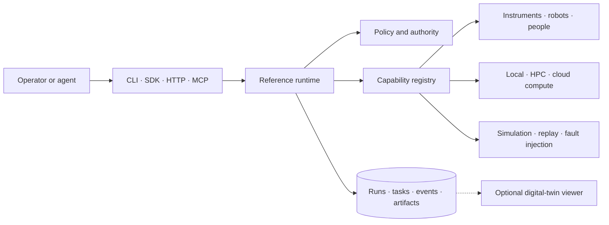

<h1 align="center">OpenSDL</h1>

<p align="center"><strong>An open foundation for building computational and autonomous laboratories.</strong></p>

<p align="center">
  <a href="#project-status"></a>
  <a href="https://github.com/fl-sean03/OpenSDL/actions/workflows/ci.yml"></a>
  <a href="https://seanflorez.com/OpenSDL/"></a>
  <a href="pyproject.toml"></a>
  <a href="LICENSE"></a>
</p>

## What OpenSDL is

OpenSDL is a framework for declaring what a laboratory can do, executing those declarations as
reproducible workflows, preserving the evidence they produce, and feeding a result back into the
choice of the next experiment.

A capability is the central abstraction: one typed operation with declared inputs, outputs,
resources, side effects, risk class, timeout, retry behavior, and simulation status. A person, an
instrument, a robot, a simulator, an analysis routine, a compute system, or an optimizer can execute
one, and a workflow keeps its shape when the executor changes. Adapters hold the vendor and facility
specifics, so no single device protocol or orchestration backend is assumed: an adapter can wrap
SiLA 2, OPC UA, EPICS, ROS 2, SCPI/VISA, Slurm, a vendor SDK, a human task, or an internal service.

The framework is domain-neutral. The materials, chemistry, and physics packs in `domain-packs/` are
extensions that add typed scientific models; the core knows nothing about them.

It runs headless. The operator surfaces are a command line, a Python SDK, an HTTP API, and an
optional MCP hook. A relational store and a content-addressed artifact store keep planned inputs,
executed inputs and outputs, append-only events, immutable artifact bytes, campaign decisions, and
current-state projections separate. Research graphs are a projection of those records.



**Documentation: <https://seanflorez.com/OpenSDL/>** — concepts, guides, and the CLI, API,
configuration, and compatibility reference. It is rebuilt from `main` on every push, so it describes
the alpha as it currently stands and not a released version. In the repository, those pages are in
[`docs/`](docs/), libraries in `packages/`, applications in `apps/`, integrations in `adapters/`,
scientific extensions in `domain-packs/`, runnable laboratories in `examples/`, and cross-package
suites in `tests/`. The [architecture overview](docs/architecture/overview.md) explains that shape,
[AGENTS.md](AGENTS.md) is the entry point for agents, and the
[development guide](docs/development/index.md) is the contributor workflow.

## Quick start

Python 3.12 or newer and [`uv`](https://docs.astral.sh/uv/) are the only prerequisites.

```bash
git clone https://github.com/fl-sean03/OpenSDL.git opensdl && cd opensdl
uv sync --locked --all-packages --group dev
uv run --locked python examples/simulated-color-mixing/run_campaign.py
```

The reference campaign creates virtual samples, measures color and mass, scores each experiment,
persists every run and event, records the campaign's decisions, and reports the recipe closest to the
target. It runs on the two prerequisites above and nothing else: no hardware, no accounts, no
services. `make example` runs the same thing, and `opensdl serve-api --manifest <manifest>` serves
the same laboratory over HTTP with its OpenAPI page at `/docs`. The
[quick start](docs/getting-started/quickstart.md) adds running one workflow directly and inspecting a
manifest; [closed-loop campaign](docs/guides/closed-loop-campaign.md) explains what the campaign does.

## What the alpha provides

- a versioned laboratory manifest, and domain-neutral models for capabilities, resources, workflows,
  runs, tasks, events, artifacts, observations, decisions, authorizations, and incidents, exported as
  generated JSON Schemas;
- a durable runtime with DAG execution, retries, timeouts, resource leases, restart reconciliation,
  and policy checks, over SQLite metadata and content-addressed artifact storage; the columns are
  portable, but no PostgreSQL service is exercised by any test or CI job;
- entry-point discovery for adapters, optimizers, and domain packs, with deterministic virtual mixer,
  balance, colorimeter, and labware-transport capabilities, three fixed numerical compute
  capabilities, a structured human-task record, and a campaign runner that scores each run and feeds
  an optimizer — the reference grid optimizer discards that feedback and enumerates a fixed grid;
- run export as a portable RO-Crate-style ZIP, a propagation graph making a change's blast radius
  queryable, generators for laboratories, adapters, capabilities, and domain packs, and unit,
  integration, end-to-end, and conformance tests.

The [roadmap](docs/development/roadmap.md) itemizes the alpha with the limits of each entry, the
[validation report](docs/development/validation.md) separates what CI enforces on every change from
what is asserted and unverified, and the [backlog](docs/development/backlog.md) tracks what is next.

## Optional: visual review and replay

A manifest may declare a `twin` block binding a 3D scene to the laboratory's resources and to the
events a run persists. That supports two things: reviewing a workflow by executing it in simulation
and watching the projection, and replaying a run already recorded in the store. The campaign in the
quick start declares no `twin` block.

The viewer is read-only and draws only what the stored records contain. A scene carries no physics,
kinematics, or collision model, so what it shows is evidence about the run that was recorded, not
about reachability, clearance, transfer accuracy, calibration, or safe placement.
[Lab-specific digital twins](docs/architecture/digital-twin.md) sets out the ownership model and what
a projection can and cannot show.

<p align="center">
  
  <br>
  <sub>The repository's one reference scene, rendered from the procedural Blender source committed
  beside it; the optional viewer draws this same scene when replaying a recorded run. OpenSDL ships
  no equipment-model catalog — a laboratory authors its own scene in its own repository.
  <a href="examples/digital-twin-surrogate/scene/renders/opensdl-surrogate-cell.mp4">The 49-second
  render</a> · <a href="examples/digital-twin-surrogate/README.md">the example behind it</a> ·
  <a href="docs/guides/build-a-twin-scene.md">building a scene</a>.</sub>
</p>

## Build a laboratory of your own

```bash
uv run --locked opensdl init ../my-lab --name my-lab --owner my-organization
```

The public framework and an organization's laboratory belong in separate repositories. `opensdl init`
scaffolds an independent project that consumes versioned OpenSDL packages and owns its equipment,
workflows, adapters, policies, context, and deployment; fork OpenSDL itself only when you intend to
change the framework. Its adapters, optimizers, and domain packs load through standard Python entry
points, so they can stay local or ship as independent packages, and `opensdl adapter create` and
`opensdl domain-pack create` generate installable skeletons. No distribution is published to a
package index yet, so a generated laboratory installs from a local wheelhouse built out of this
checkout. [Create a laboratory](docs/guides/create-lab.md) covers that,
[lab onboarding](docs/architecture/lab-onboarding.md) what happens after, and
[add an adapter](docs/guides/add-adapter.md) the simulator and conformance cases every operational
adapter needs.

## Safety boundary

OpenSDL is not a safety instrumented system, an emergency-stop circuit, a process hazard analysis, or
a compliance certification. Physical interlocks and deterministic protective systems remain
independent of the framework.

The reference profile is simulator-only, and no adapter in this repository has been connected to
physical equipment. A real deployment owns its engineering controls, validation, authorization,
network segmentation, training, operating procedures, and regulatory obligations.
[SAFETY.md](SAFETY.md) states where the framework stops and a laboratory's protective systems begin.

## Project status

This is an executable alpha, not production-qualified laboratory control software. Nothing is tagged
and nothing is published, so no version can be installed from an index. The core loop, structured
human-task path, simulated robotics path, and local compute path are implemented and tested. Current
work is production authentication, richer approval workflows, MADSci and SiLA 2 integrations, Slurm
execution, expanded conformance, and a first low-risk hardware reference integration.

No contract is stable between releases and there is no deprecation window; the database schema is the
exception, since every change ships an Alembic revision that upgrades a store in place.
[Compatibility and versioning](docs/reference/compatibility.md) states exactly which surfaces are
public, what each guarantees today, and what a laboratory should pin; read it before depending on any
of them, and the [changelog](CHANGELOG.md) for what has already moved.
[Contributing](CONTRIBUTING.md) covers how changes are proposed and who decides.

## License

Software, schemas, examples, and documentation are provided under the [Apache License 2.0](LICENSE)
unless a directory states otherwise. Hardware designs and datasets should carry explicit licenses
appropriate to those artifacts.
