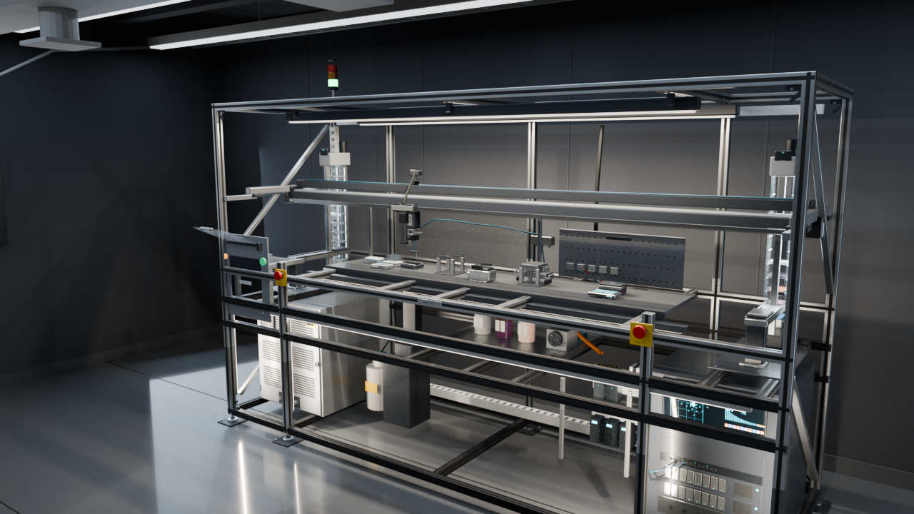

# Digital-twin surrogate laboratory

This is OpenSDL's complete digital-twin reference example. A deterministic simulation adapter runs
one formulation workflow, persisted events become visual cues, and a read-only viewer applies those
cues to a detailed 3D laboratory line.



The scene is a self-driving cell: a 3.6 x 1.12 x 2.2 m aluminium-extrusion machine frame standing
on levelling feet through anchored floor plates, in a plant space rather than in a laboratory room.
There is no casework, no worktop and no operator position. The frame carries the transport runway on
its own end towers, a hard-anodised process plate at 1135 mm, two plate hotels holding the queue of
work, and - packed into the volume under the deck - the controls cabinet, the open drive bank, the
bulk reagent supply, the waste column, and the rack running the campaign with its state on one
display. Material crosses the boundary at exactly one interlocked load and unload port. Nothing is
enclosed, so every stage of the workflow can be seen while it runs. Each machine is a full-scale,
original reconstruction that uses published dimensions and operating behavior for the gripper,
8-channel pipette, plate hotels, orbital mixer, absorbance reader, and labware. It includes no
manufacturer CAD, product images, textures, logos, or copied meshes. See
[scene/SOURCES.md](scene/SOURCES.md) for provenance.

This is the framework's only complete scene. It proves the public contracts and viewer path; it is
not the first entry in an equipment-model catalog. Each laboratory builds its own tailored scene in
its own repository.

## What the cell does

The adapter-neutral workflow uses four semantic capabilities:

1. `cell.transfer_labware` moves the plate from `input` to `dispense`.
2. `cell.dispense` adds 40 µL of reagent A and 60 µL of reagent B to each of 96 wells.
3. `cell.transfer_labware` moves the plate to `mix`.
4. `cell.mix` applies the declared 800 rpm, 20-second operation.
5. `cell.transfer_labware` moves the plate to `characterize`.
6. `cell.characterize` returns a deterministic normalized response.
7. `cell.transfer_labware` moves the plate to `output`.

The 49-second scene animation expands those tasks into visible equipment actions. There is one
mover on the bridge and two interchangeable heads. The input hotel's shuttle presents a plate at the
front of its station and the mover, wearing the gripper head, carries it to the dispensing stage. It
then parks the gripper head in `HeadDock_Gripper`, couples the pipetting head out of
`HeadDock_Pipette`, and runs two 8-channel pipetting passes; the reverse change puts the gripper
back on for everything after. The mixer uses a 2 mm-diameter orbital translation with no plate yaw.
The gripper head moves the reader door between the reader and its dock behind it, then sends the
plate to the output hotel.

The two head changes occupy frames 150-208 and 552-612. They are the only frames no workflow phase
covers, because a head change is the cell's own housekeeping rather than a commanded operation.

The animation timing illustrates the sequence. It does not reproduce device cycle times.

## Frame and station layout

The machine frame is 3.6 m along the transport axis, 1.12 m deep and 2.2 m tall, in 45-series
T-slot profile: four corner towers, three rear intermediates and two front intermediates, standing
on levelling feet through anchor plates bolted to the slab. Horizontal members tie them at five
working planes - a base tie at 85 mm, the fluid service plane at 720 mm, the hotel mounting plane at
890 mm, the deck carriers at 1095 mm, and the top tie at 2178 mm that the work-light bars hang from.
The plant space around it is 6.6 x 5.6 x 3.1 m with a sealed resin floor, plain panel walls, and an
exposed soffit carrying linear battens, a cable ladder and a duct run.

Every height is set by the transport. The process plate sits at 1135 mm because that is where the
bridge can put a plate down, and the mounting plane exists only so the tall hotels present their
nests level with it. Five stations stand along the transport axis at 780 mm pitch; each owns a world
X offset and every slot inside it is placed relative to that offset. The two runway beams land
directly on the frame's end towers, so the transport is part of the machine rather than four posts
bolted to a bench.

| Station | X offset | Slots |
|---|---|---|
| `Station_Input` | -1.56 m | `input-hotel` (magazine), `input-handoff` (shuttle presentation) |
| `Station_Dispense` | -0.78 m | `reservoir`, `tips`, `tip-waste` (rear row), `stage` (front row) |
| `Station_Mix` | 0.00 m | `mixer` |
| `Station_Characterize` | +0.78 m | `reader` (front row), `door-dock` (rear row) |
| `Station_Output` | +1.56 m | `output-hotel` (magazine), `output-handoff` (shuttle presentation) |

The two head docks stand on the rear row of the deck between the stations, `HeadDock_Pipette` at
-0.30 m and `HeadDock_Gripper` at +0.30 m. Their order is load-bearing: each dock sits on the far
side of the machine from the work the other head does, so a coupled head never travels over the
other head waiting in its cradle.

The three in-line process stations are positions on one 2.32 m hard-anodised tooling plate on an M6
fixing grid, not three machines on three pedestals. The two hotels stand outside that plate on the
mounting plane, which puts the input at one end of the machine and the output at the other; both are
open magazines, so the queue of plates waiting to run and the measured plates coming back are
visible without opening anything. Within a station the scene keeps 164 mm horizontal slot pitch,
107 mm row pitch, and ANSI/SLAS labware scale.

## Prerequisites

Install the locked Python workspace from the repository root:

```bash
uv sync --locked --all-packages --group dev
```

Scene generation uses Blender in background mode. MP4 output also requires `ffmpeg`. The viewer's
development workflow requires Node.js 22.12 or newer. The checked-in scene was built with Blender
5.2.

The example adapter is not a root workspace member. Commands that load the laboratory manifest add
it as a temporary editable overlay and leave `uv.lock` unchanged.

## Build and check the 3D scene

Generate the Blender source, GLB, node inventory, and motion report:

```bash
blender -b --factory-startup -noaudio \
  -P examples/digital-twin-surrogate/scene/build_scene.py
```

The script checks required nodes and 70 motion, placement, labware, tip, liquid, lid, and hotel
conditions before it writes the final outputs. Read [scene/README.md](scene/README.md) for render
options and file details.

A deliberate rebuild can change the GLB digest. Review the new output, then update `scene.sha256` in
`twin.yaml` to the value reported by:

```bash
sha256sum examples/digital-twin-surrogate/scene/assets/surrogate-cell.glb
```

Validate the twin definition and digest:

```bash
uv run --locked opensdl twin validate \
  examples/digital-twin-surrogate/twin.yaml
```

## Validate and run the workflow

Validate the manifest and workflow schemas:

```bash
uv run --locked opensdl validate \
  examples/digital-twin-surrogate/opensdl.yaml \
  --workflow examples/digital-twin-surrogate/workflow.yaml
```

Run the formulation with a stable identifier:

```bash
uv run --locked \
  --with-editable ./examples/digital-twin-surrogate/adapter \
  opensdl run examples/digital-twin-surrogate/workflow.yaml \
  --manifest examples/digital-twin-surrogate/opensdl.yaml \
  --inputs @examples/digital-twin-surrogate/inputs.json \
  --operator-id operator/showcase \
  --run-id surrogate-showcase-001
```

The run finishes with `showcase-plate-001` at `output`, `100.0 µL` per well (`9,600.0 µL`
aggregate), and a deterministic dimensionless characterization value of `0.56`. OpenSDL writes
runtime records and artifacts below `examples/digital-twin-surrogate/.opensdl/`.

Project the persisted events into visual cues:

```bash
uv run --locked \
  --with-editable ./examples/digital-twin-surrogate/adapter \
  opensdl twin project surrogate-showcase-001 \
  --manifest examples/digital-twin-surrogate/opensdl.yaml
```

The run records the current twin revision, definition digest, and scene digest in its `RunCreated`
event. Projection refuses a run whose recorded binding differs from the configured twin. The alpha
does not retain historical definition or scene snapshots, so replay requires that exact binding to
remain current.

Run the example tests:

```bash
uv run --locked \
  --with-editable ./examples/digital-twin-surrogate/adapter \
  pytest examples/digital-twin-surrogate/tests
```

These tests cover adapter conformance, deterministic state and failures, the complete workflow,
semantic parity with a fake physical adapter, and the manifest swap boundary.

## Open the viewer

Build the checked-in viewer:

```bash
cd examples/digital-twin-surrogate/viewer
npm ci
npm test
npm run lint
npm run typecheck
npm run build
cd ../../..
```

Start the API with the example adapter available:

```bash
uv run --locked \
  --with-editable ./examples/digital-twin-surrogate/adapter \
  opensdl serve-api \
  --manifest examples/digital-twin-surrogate/opensdl.yaml \
  --host 127.0.0.1 \
  --port 8000
```

Open `http://127.0.0.1:8000/viewer?run=surrogate-showcase-001`. The viewer reads the twin definition,
GLB, and projected cue sequence from the API. The API recalculates the GLB digest for every scene
request. The browser checks the downloaded bytes again before parsing them. Missing declared scene
nodes stop loading.

Playback scrubs the authored 1176-frame GLB timeline through the frame ranges declared in
`animationTimeline`. The viewer can orbit, zoom, play, pause, reset, and scrub. It cannot send
equipment commands or change runtime state.

For a scene-only demonstration, run `npm run dev` from `viewer/` and open the displayed `/viewer/`
URL. If the API is unavailable, the development server uses the included reference definition,
scene, and deterministic cue sequence. An API-hosted twin receives these reference cues only when
its revision and scene digest match the included showcase. Any other configured twin opens with no
run cues until the URL names a compatible persisted run.

## Physical adapter swap

[`opensdl.physical-example.yaml`](opensdl.physical-example.yaml) documents the deployment boundary.
Compared with [`opensdl.yaml`](opensdl.yaml), only the environment and adapter binding change. The
workflow, capability identifiers, logical adapter name, resources, and policy shape remain stable.

The repository does not supply the `qualified-physical-cell` plugin. A deployment must implement
and qualify that adapter, review limits and failure semantics, commission its equipment, and apply
site policy before physical execution.

## Limits

The simulation adapter is a deterministic state machine. The Blender scene and viewer are workflow
visualizations. Together they do not establish:

- reachability, collision avoidance, kinematics, force limits, or guarding;
- pipetting accuracy, mixing performance, thermal response, or reader accuracy;
- equipment calibration, connectivity, commissioning, or physical readiness; or
- safety integrity, regulatory compliance, or live-state agreement.

Use equipment tests, robotics simulation, engineering analysis, and commissioning evidence for
those claims.

## Files

- `capabilities/`: vendor-neutral capability cards;
- `adapter/`: deterministic example-local simulation plugin;
- `workflow.yaml` and `inputs.json`: representative operation and inputs;
- `opensdl.yaml`: runnable simulation manifest;
- `opensdl.physical-example.yaml`: non-runnable physical binding example;
- `twin.yaml`: scene binding and event projection rules;
- `scene/`: procedural source, generated assets, validation output, and renders;
- `viewer/`: read-only Three.js client and built static site; and
- `tests/`: focused conformance, parity, manifest, and end-to-end tests.
